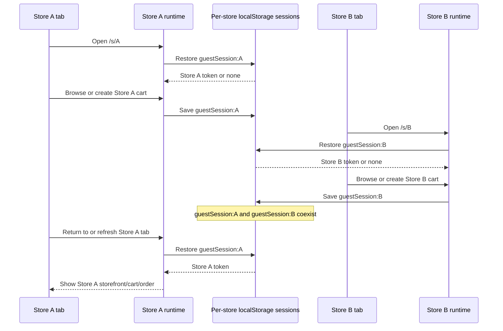
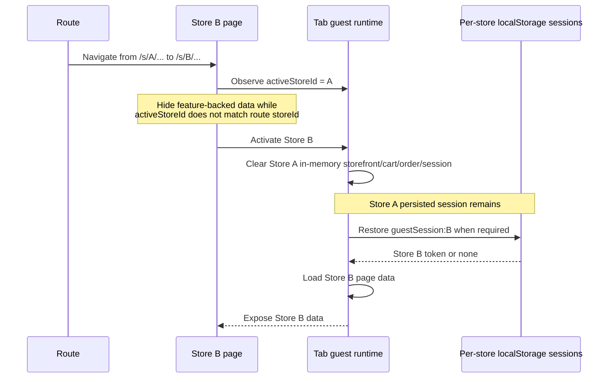
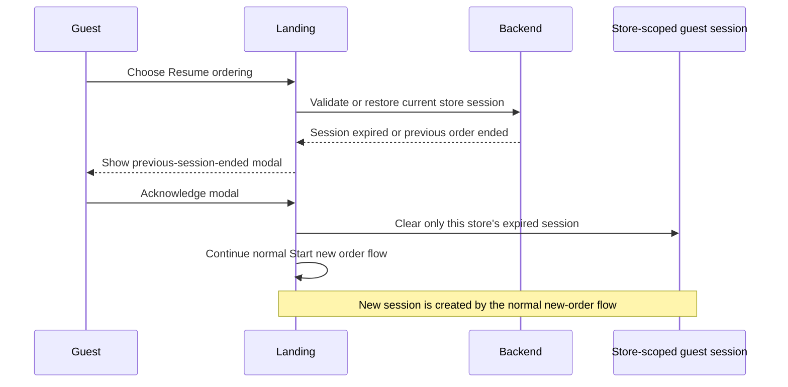

# Guest Multi-Store Sessions

## Purpose

Guest ordering supports opening different stores in different browser tabs
without one store replacing or displaying another store's session, storefront,
cart, or order.

Each guest route uses `/s/:storeId`. The route `storeId` is the source of truth
for the store that the tab is allowed to display and operate on.

Landing, Resume, Join, and Recent orders UI behavior is defined in
[`guest-ordering-entry-flow.md`](./guest-ordering-entry-flow.md).

## Code Map

Frontend:

- `apps/web/src/app/global/guestSession/`
- `apps/web/src/features/storeFront/runtime.ts`
- `apps/web/src/features/storeFront/sessionWorkflow/`
- `apps/web/src/features/storeFront/{storefront,cart,order}/`
- `apps/web/src/pages/storeFront/`

## User-Visible Behavior

- Store A and Store B may remain open in separate tabs at the same time.
- Actions in Store B do not replace Store A's guest session.
- Returning to Store A continues showing Store A data.
- Refreshing either tab restores only that tab's route store session.
- Leaving or expiring Store A clears only Store A's session.
- An expired stored session does not block the landing page. It is validated
  only after the guest chooses "Resume ordering".
- Navigating one tab from Store A to Store B never displays Store A data under
  the Store B route, including while Store B initializes.
- Within one store, one browser profile keeps at most one persisted active guest
  session.

## Different-Store Tabs

Each tab has its own in-memory guest runtime. Persisted guest sessions are shared
through localStorage but partitioned by `storeId`.



Opening Store B does not cause an already-open Store A tab to display Store B.
The tabs do not share JavaScript runtime state.

## Same-Tab Store Navigation

One tab keeps one active guest feature runtime. When its route changes to a
different store, the previous store's in-memory feature state is deactivated
before the new store's data is exposed.



The page must not render storefront, cart, or order state unless the active
runtime store matches the route `storeId`. This prevents a render frame from
briefly showing the previous store.

## Session Isolation

Persisted sessions use a store-scoped key:

```txt
ordering-platform.guestSession:<storeId>
```

Operations have store-scoped effects:

| Event | Store A session | Store B session |
| --- | --- | --- |
| Open or order from Store B | Unchanged | Created or updated |
| Navigate one tab from A to B | Remains persisted | Restored when needed |
| Leave Store A cart | Cleared | Unchanged |
| Resume Store A after its session expires | Show modal, clear A, then start a new A session | Unchanged |
| Refresh Store A tab | Restored | Unchanged |

Cart and order commands must reject a guest token when its session `storeId`
does not match the expected route store. Backend authorization independently
validates the token's store, cart, and participant scope.

## Expired Resume Flow

Stored sessions are validated lazily. The landing page may show "Resume
ordering" based on persisted state without first calling the backend.



The landing page must not perform this backend validation before the guest
chooses "Resume ordering". Expired sessions are removed only when accessed; no
background cleanup is required.

## Same-Store Tabs

Multiple tabs for the same store may restore the same persisted guest session.
Their in-memory storefront, cart, and order state remains independent.

Changes made in one same-store tab are not guaranteed to appear immediately in
another tab. A reload, explicit refetch, or future synchronization mechanism is
required. This does not permit either tab to use another store's session.

## Frontend Ownership

- `src/app/global/guestSession` owns guest identity, tokens, per-store
  persistence, and the current tab's active session identity.
- `src/features/storeFront/runtime.ts` wires the shared live storefront feature runtime
  used by storefront pages inside one tab.
- Guest tenant workflow commands activate the route store and clear stale
  in-memory feature state.
- Guest session workflow commands restore or end one store's session and
  coordinate related cart/order state.
- Page commands pass route `storeId` and explicitly order activation, session
  restore, and page data loading.
- Page VMs own route lifecycle and hide feature-backed data until the runtime
  store matches the route store.

Tenant activation does not implicitly restore a session:

```txt
activate route store
  -> restore that store's session when required
  -> load page data
```

## Notes

- Multi-store session isolation is a frontend state and persistence boundary,
  not an authorization boundary.
- Different-store tabs are supported independently.
- Same-store multi-tab live synchronization is not currently required.
- Existing unscoped guest-session storage is discarded. No compatibility or
  migration behavior is required.
