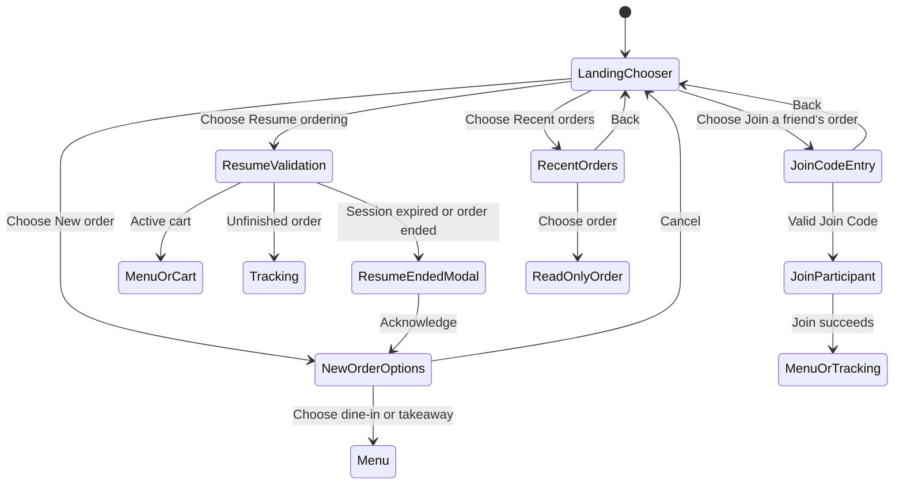
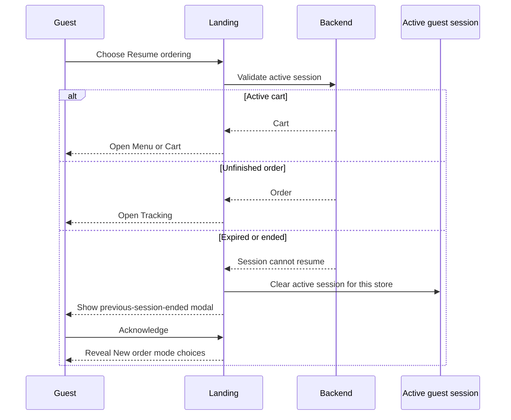

# Guest Ordering Entry Flow

## Purpose

Define how a guest enters, resumes, joins, or reviews orders from a store's
Landing page.

The Landing page is the chooser for the current store. It does not display an
order-mode picker, Join Code form, or order history list until the guest chooses
the corresponding action.

## Entry Actions

Landing route:

```txt
/s/:storeId
```

The Landing page offers these actions:

- **New order**: always available while the store accepts ordering.
- **Join a friend's order**: always available.
- **Resume ordering**: shown only when this browser has a persisted active guest
  session for the route store.
- **Recent orders**: shown as a secondary link only when this browser has
  non-expired order history entries for the route store.

`Resume ordering` and `Recent orders` are different capabilities:

- Resume returns to the one active cart or unfinished order represented by the
  store's active guest session.
- Recent orders opens read-only references to orders this browser participated
  in during the last 24 hours.

## Landing State Flow



## New Order

Choosing **New order** conditionally reveals the enabled order modes on the
Landing page. The order-mode controls are hidden before this action.

- Show only modes enabled by `Store.operation.orderModes`.
- Choosing dine-in or takeaway starts the new-order flow and navigates to Menu.
- A table number from the Landing URL is carried into dine-in ordering.
- Cancel returns to the initial Landing chooser without creating a session.
- If an active session exists, confirm before abandoning it and opening the
  order-mode choices.

Even when the store enables only one order mode, the mode is shown after the
guest chooses **New order**. This avoids creating or replacing a session from a
single ambiguous button press.

## Join A Friend's Order

Choosing **Join a friend's order** navigates to a dedicated Join Code entry
page:

```txt
/s/:storeId/join
```

Keep Join Code entry on a separate route instead of conditionally rendering it
inside Landing because it has its own input, validation, error, loading, and
back-navigation states.

After a valid code is entered, the flow may continue to a participant-name step
or join directly, depending on the final join API behavior. Shared invite links
continue to use:

```txt
/s/:storeId/join/:joinCode
```

Both entry paths join the same store-scoped cart or order. Joining another order
must confirm before replacing an existing active session for that store.

## Resume Ordering

Landing shows **Resume ordering** from persisted active-session presence without
validating it in advance.



An ended Resume attempt does not automatically create a replacement session.
The guest must still choose dine-in or takeaway.

## Recent Orders

Recent orders are a browser-local convenience, not an account-backed history or
security boundary.

- Store entries separately from the active guest session.
- Partition entries by `storeId`.
- Add or update an entry when a submitted order is created or joined.
- Keep the entry when that order becomes completed/cancelled or when another
  active session replaces it.
- Keep entries for 24 hours using a frontend TTL.
- Remove expired entries lazily when history is read.
- Remove an entry when its order API returns `not-found` or `forbidden`.
- Clearing browser storage or changing devices loses the list.

Suggested local entry:

```ts
type GuestOrderHistoryEntry = {
  orderId: string;
  token: string;
  createdAt: string;
  expiresAt: string;
};
```

Suggested store-scoped key:

```txt
ordering-platform.storeFrontOrderHistory:<storeId>
```

Each history entry keeps the token that authorizes that participant to read the
order. Opening a recent order is read-only and must not replace, resume, or clear
the store's active guest session.

Recent orders may therefore contain both unfinished and ended orders. The
Landing page still uses **Resume ordering** only for the current active session;
it does not infer Resume behavior from the history list.

The 24-hour TTL controls whether the frontend offers the order in Recent orders.
It does not require the backend to reject an otherwise valid order-view request
after 24 hours.

## Route Summary

| Route                         | Responsibility                                           |
| ----------------------------- | -------------------------------------------------------- |
| `/s/:storeId`                 | Landing chooser and conditional new-order mode selection |
| `/s/:storeId/join`            | Manual Join Code entry                                   |
| `/s/:storeId/join/:joinCode`  | Shared-link join flow                                    |
| `/s/:storeId/orders`          | Recent orders list                                       |
| `/s/:storeId/orders/:orderId` | Active tracking or read-only recent-order detail         |

## Notes

- One store keeps at most one active guest session, but may keep multiple recent
  order entries.
- Different stores keep independent active sessions and recent-order histories.
- Active tracking may use live updates; a completed or cancelled recent order is
  read-only.
- The order detail page must use the token belonging to the selected history
  entry rather than assuming the current active-session token.
