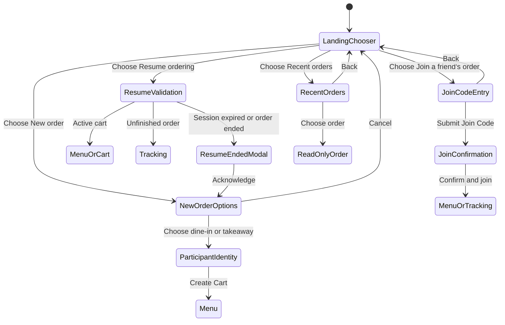
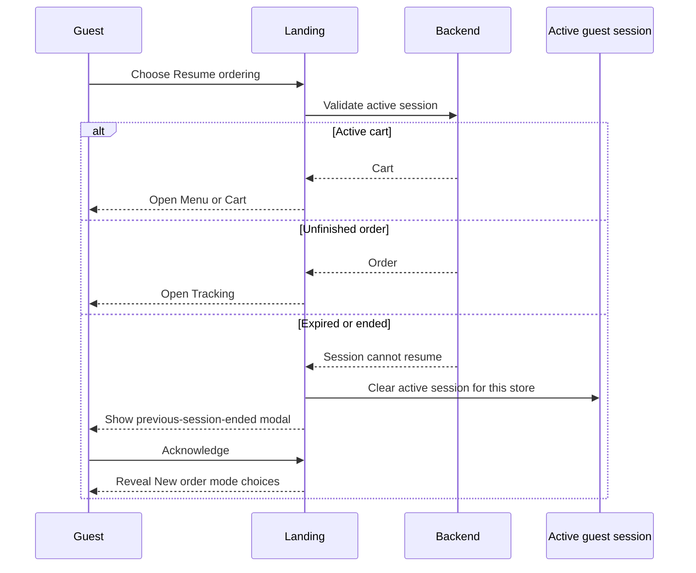

# Guest Ordering Entry Flow

## Purpose

Define how a guest enters, resumes, joins, or reviews orders from a store's
Landing page.

The Landing page is the chooser for the current store. It does not display an
order-mode picker, Join Code form, or order history list until the guest chooses
the corresponding action.

## Entry Actions

Landing route:

```txt
/s/:storeId
```

The Landing page offers these actions:

- **New order**: always available while the store accepts ordering.
- **Join a friend's order**: always available.
- **Resume ordering**: shown only when this browser has a persisted active guest
  session for the route store.
- **Recent orders**: shown as a secondary link only when this browser has
  non-expired order history entries for the route store.

`Resume ordering` and `Recent orders` are different capabilities:

- Resume returns to the one active cart or unfinished order represented by the
  store's active guest session.
- Recent orders opens read-only references to orders this browser participated
  in during the last 24 hours.

## Landing State Flow



## New Order

Choosing **New order** conditionally reveals the enabled order modes on the
Landing page. The order-mode controls are hidden before this action.

- Show only modes enabled by `Store.operation.orderModes`.
- Choosing dine-in or takeaway opens participant identity selection before Cart
  creation. The guest chooses an avatar and may enter a custom display name,
  then the new Cart is created and Menu opens.
- A table number from the Landing URL is carried into dine-in ordering.
- Cancel returns to the initial Landing chooser without creating a session.
- If the active session is a not-yet-submitted cart, confirm before abandoning it
  and opening the order-mode choices.
- If the active session is an **unfinished order** (submitted, not yet
  completed/cancelled), it cannot be abandoned to start or join another order: it
  is a live, often unpaid obligation, and leaving only forgets it locally. The
  landing blocks New order / Join and prompts the guest to **Resume** it instead.

Even when the store enables only one order mode, the mode is shown after the
guest chooses **New order**. This avoids creating or replacing a session from a
single ambiguous button press.

## Join A Friend's Order

Choosing **Join a friend's order** navigates to a dedicated Join Code entry
page:

```txt
/s/:storeId/join
```

Keep Join Code entry on a separate route instead of conditionally rendering it
inside Landing because it has its own input, validation, error, loading, and
back-navigation states.

Submitting a manually entered code navigates to the shared Join confirmation
route without calling the Join API:

```txt
/s/:storeId/join/:joinCode
```

Opening a shared Invite link or scanning its QR Code opens that same route. Join
confirmation shows the Join Code, avatar picker, and optional custom display
name; the Join API is called only after the guest confirms. A successful active
Cart join opens Menu, while joining an open pay-later Order opens Tracking.
Before confirmation, the page loads only the public Store summary and does not
expose group participants, Cart items, table number, or Order details.

Both entry paths join the same store-scoped Cart or Order. Joining another group
must confirm before replacing an existing active session for that store, and is
blocked when the existing session is an unfinished order (the guest must resume
that order first; see New Order above).

## Resume Ordering

Landing shows **Resume ordering** from persisted active-session presence without
validating it in advance.



An ended Resume attempt does not automatically create a replacement session.
The guest must still choose dine-in or takeaway.

## Recent Orders

Recent orders are browser-local and separate from the active guest session. The
Landing page only uses them to decide whether to show the secondary **Recent
orders** link; it does not infer Resume behavior from the history list.

See [`order-history.md`](./order-history.md) for storage keys, TTL, write
sources, and read-only history-order behavior.

## Route Summary

| Route                         | Responsibility                                           |
| ----------------------------- | -------------------------------------------------------- |
| `/s/:storeId`                 | Landing chooser and conditional new-order mode selection |
| `/s/:storeId/join`            | Manual Join Code entry                                   |
| `/s/:storeId/join/:joinCode`  | Shared Join confirmation for manual entry, link, and QR  |
| `/s/:storeId/invite`          | Join Code, Invite link, QR, and copy-link actions        |
| `/s/:storeId/orders`          | Recent orders list                                       |
| `/s/:storeId/orders/:orderId` | Active tracking or read-only recent-order detail         |

## Notes

- One store keeps at most one active guest session, but may keep multiple recent
  order entries.
- Different stores keep independent active sessions and recent-order histories.
- Active tracking may use live updates; a completed or cancelled recent order is
  read-only.
- The order detail page must use the token belonging to the selected history
  entry rather than assuming the current active-session token.
- Clearing the cart for a submitted round does not clear the guest session. The
  session is cleared when the token/session is unusable, the guest leaves an
  unsubmitted cart, or the active order has finished (`completed`/`cancelled`).
