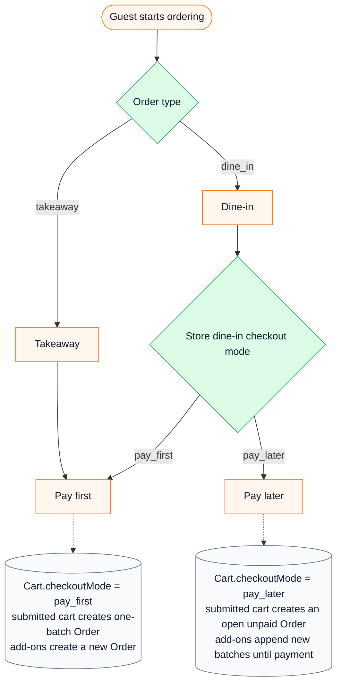
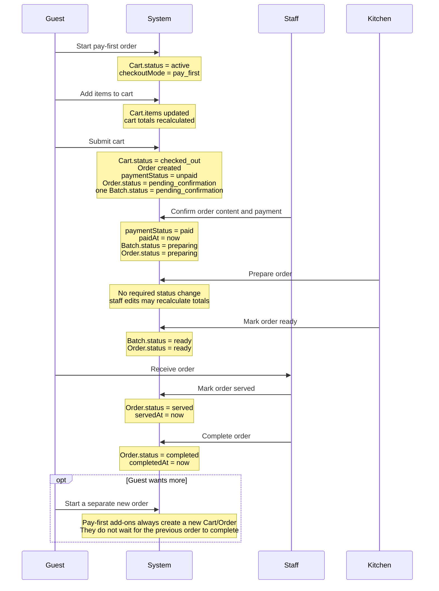
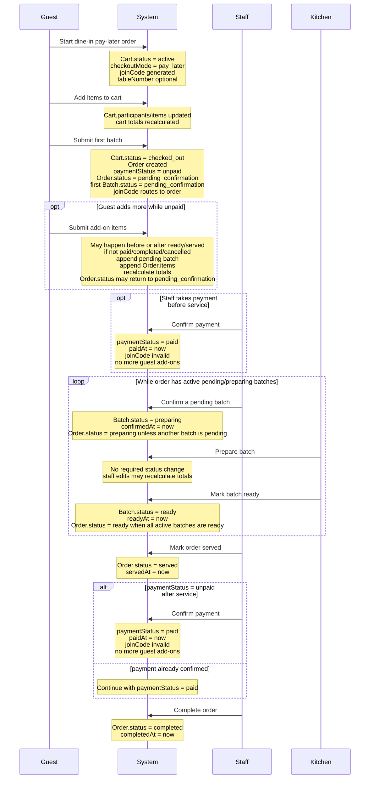

# Ordering Flow Diagrams

Mermaid diagrams for the current agreed ordering behavior.

MVP does not integrate online payment. Staff manually confirms payment.

## Overview

## Pay First

Pay-first applies to takeaway and may also apply to dine-in. Dine-in pay-first
can use `tableNumber` or rely on `displayNumber` for pickup.

## Pay Later

Pay-later currently applies to dine-in. Guests may add more before payment.
Payment locks guest add-ons but does not complete the order; existing batches
continue until staff marks the service complete.

