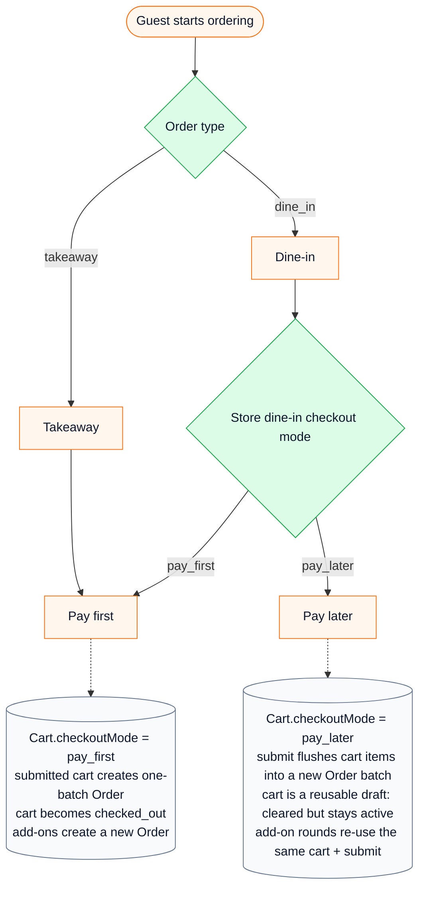
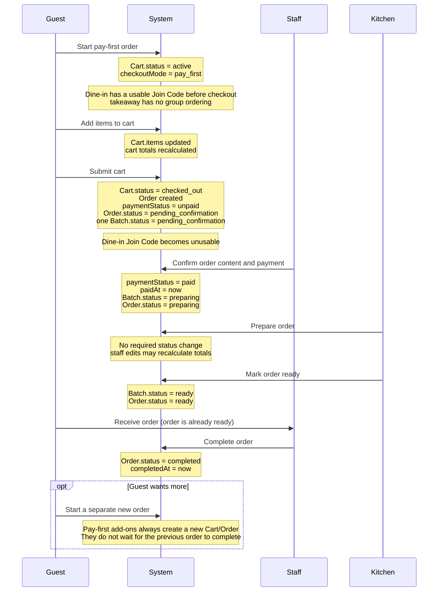
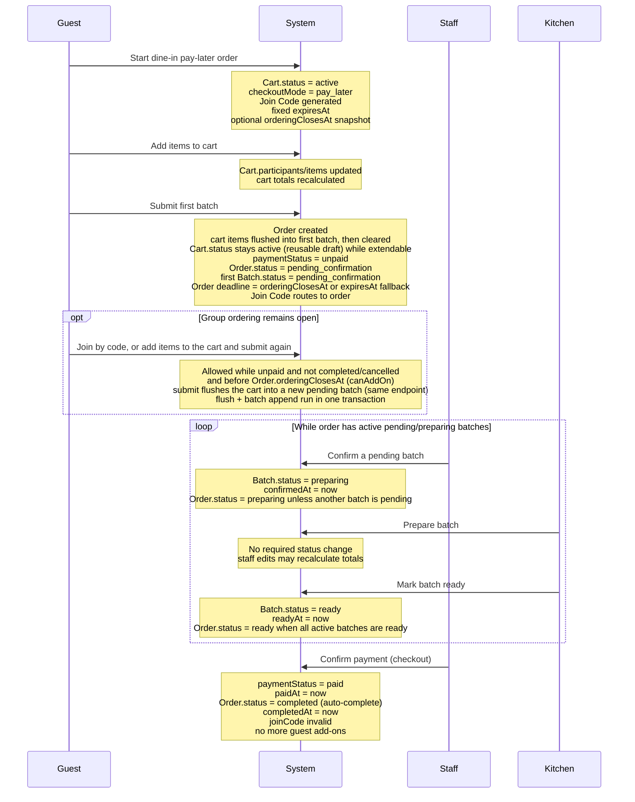

# Ordering Flow Diagrams

Mermaid diagrams for the current agreed ordering behavior.

MVP does not integrate online payment. Staff manually confirms payment.

## Overview

```mermaid
flowchart TD
  Start([Guest starts ordering])
  Type{Order type}
  DineIn[Dine-in]
  Takeaway[Takeaway]
  DineMode{Store dine-in checkout mode}
  PayFirst[Pay first]
  PayLater[Pay later]

  Start --> Type
  Type -->|dine_in| DineIn
  Type -->|takeaway| Takeaway
  Takeaway --> PayFirst
  DineIn --> DineMode
  DineMode -->|pay_first| PayFirst
  DineMode -->|pay_later| PayLater

  PayFirst -.-> PFData[(Cart.checkoutMode = pay_first\nsubmitted cart creates one-batch Order\ncart becomes checked_out\nadd-ons create a new Order)]
  PayLater -.-> PLData[(Cart.checkoutMode = pay_later\nsubmit flushes cart items into a new Order batch\ncart is a reusable draft: cleared but stays active\nadd-on rounds re-use the same cart + submit)]

  classDef action fill:#fff7ed,stroke:#f97316,color:#0f172a
  classDef decision fill:#dcfce7,stroke:#16a34a,color:#0f172a
  classDef data fill:#f8fafc,stroke:#64748b,color:#0f172a
  class Start,DineIn,Takeaway,PayFirst,PayLater action
  class Type,DineMode decision
  class PFData,PLData data
```

## Pay First

Pay-first applies to takeaway and may also apply to dine-in. Dine-in pay-first
can use `tableNumber` or rely on `displayNumber` for pickup.

```mermaid
sequenceDiagram
  participant Guest
  participant System
  participant Staff
  participant Kitchen

  Guest->>System: Start pay-first order
  Note over System: Cart.status = active<br/>checkoutMode = pay_first
  Note over System: Dine-in has a usable Join Code before checkout<br/>takeaway has no group ordering

  Guest->>System: Add items to cart
  Note over System: Cart.items updated<br/>cart totals recalculated

  Guest->>System: Submit cart
  Note over System: Cart.status = checked_out<br/>Order created<br/>paymentStatus = unpaid<br/>Order.status = pending_confirmation<br/>one Batch.status = pending_confirmation
  Note over System: Dine-in Join Code becomes unusable

  Staff->>System: Confirm order content and payment
  Note over System: paymentStatus = paid<br/>paidAt = now<br/>Batch.status = preparing<br/>Order.status = preparing

  Kitchen->>System: Prepare order
  Note over System: No required status change<br/>staff edits may recalculate totals

  Kitchen->>System: Mark order ready
  Note over System: Batch.status = ready<br/>Order.status = ready

  Guest->>Staff: Receive order (order is already ready)
  Staff->>System: Complete order
  Note over System: Order.status = completed<br/>completedAt = now

  opt Guest wants more
    Guest->>System: Start a separate new order
    Note over System: Pay-first add-ons always create a new Cart/Order<br/>They do not wait for the previous order to complete
  end
```

## Pay Later

Pay-later currently applies to dine-in. Guests may add more before payment.
Payment is the finisher for pay-later: marking the order paid also auto-completes
it. There is no separate "Complete" step for pay-later.

The cart is a **reusable per-round draft**. Submitting flushes the current cart
items into a new Order batch and clears those items, but keeps the cart `active`
while the order is still guest-extendable; add-on rounds add to that same cart
and submit again. The cart only becomes `checked_out` once add-on is no longer
allowed. Order access is **decoupled from the cart** (resolved by participant
membership), so any participant can read the order even after the cart is gone,
and expired carts auto-delete via a TTL index.

```mermaid
sequenceDiagram
  participant Guest
  participant System
  participant Staff
  participant Kitchen

  Guest->>System: Start dine-in pay-later order
  Note over System: Cart.status = active<br/>checkoutMode = pay_later<br/>Join Code generated<br/>fixed expiresAt<br/>optional orderingClosesAt snapshot

  Guest->>System: Add items to cart
  Note over System: Cart.participants/items updated<br/>cart totals recalculated

  Guest->>System: Submit first batch
  Note over System: Order created<br/>cart items flushed into first batch, then cleared<br/>Cart.status stays active (reusable draft) while extendable<br/>paymentStatus = unpaid<br/>Order.status = pending_confirmation<br/>first Batch.status = pending_confirmation<br/>Order deadline = orderingClosesAt or expiresAt fallback<br/>Join Code routes to order

  opt Group ordering remains open
    Guest->>System: Join by code, or add items to the cart and submit again
    Note over System: Allowed while unpaid and not completed/cancelled<br/>and before Order.orderingClosesAt (canAddOn)<br/>submit flushes the cart into a new pending batch (same endpoint)<br/>flush + batch append run in one transaction
  end

  loop While order has active pending/preparing batches
    Staff->>System: Confirm a pending batch
    Note over System: Batch.status = preparing<br/>confirmedAt = now<br/>Order.status = preparing unless another batch is pending

    Kitchen->>System: Prepare batch
    Note over System: No required status change<br/>staff edits may recalculate totals

    Kitchen->>System: Mark batch ready
    Note over System: Batch.status = ready<br/>readyAt = now<br/>Order.status = ready when all active batches are ready
  end

  Staff->>System: Confirm payment (checkout)
  Note over System: paymentStatus = paid<br/>paidAt = now<br/>Order.status = completed (auto-complete)<br/>completedAt = now<br/>joinCode invalid<br/>no more guest add-ons
```
