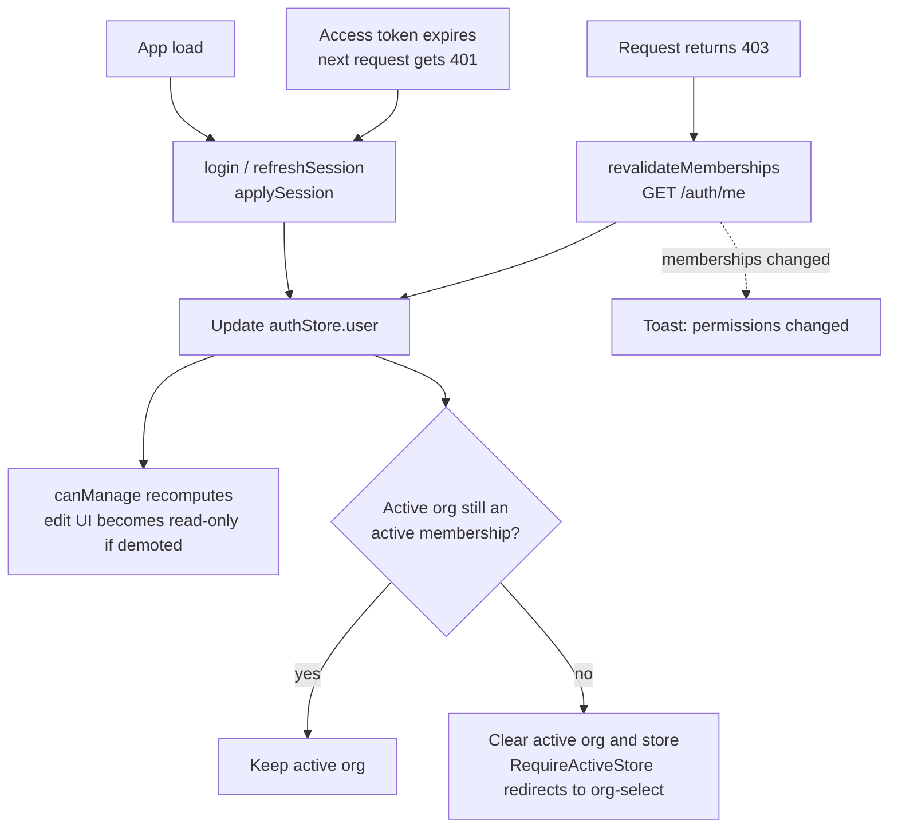
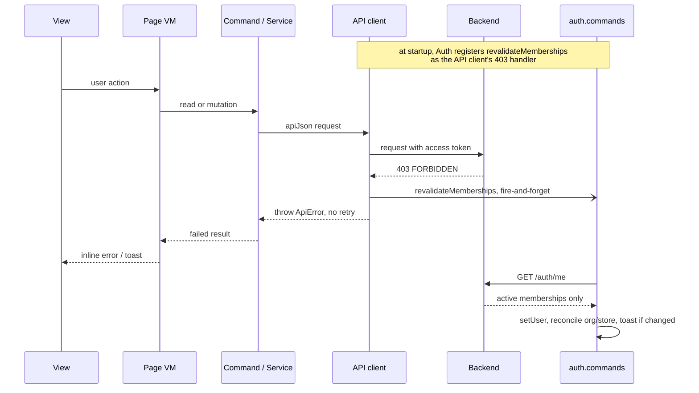

# Permission Checks — Timing & Handling

How permission is checked at runtime and what happens when it is insufficient.
For the role/resource matrix and the read-only UI pattern, see
[`permissions.md`](./permissions.md); for the 401 refresh mechanics, see
[`token-refresh.md`](./token-refresh.md).

## Two layers

- **Backend — the authority.** Every request is re-checked:
  `/api/v1/merchant/*` via `requireOrgRole(...)`, `/api/v1/admin/*` via
  `requireSuperAdmin()`. A failure is `403 FORBIDDEN`.
- **Frontend — a cached UX gate.** `canManage` is derived from
  `authStore.user.memberships`, captured at login/refresh and not refetched per
  page (`useActiveOrgRole`). It can be stale, so it self-corrects on `403`.

## When the cached gate refreshes

All three refresh paths apply the new session **and** reconcile the active
org/store, so they behave identically. The `403` path additionally toasts.

## What happens on a denied request

The request travels the normal layers (`View → Page VM → Command → API client →
Backend`). The self-heal is **inversion of control**: at startup
`auth.commands.ts` registers `revalidateMemberships` as the API client's 403
handler via `setApi403Handler` — the API client does not depend on commands, it
just fires a pre-registered callback. So one `403` does two independent things:
the error propagates back **up** the chain to the view, and the API client fires
the handler as a fire-and-forget side-channel. The forbidden request is never
retried.

## Outcomes and timing

`/auth/me` returns only `status: 'active'` memberships, which drives the
reconcile branch above.

| Server-side change            | First `403` on                 | Result                                            |
| ----------------------------- | ------------------------------ | ------------------------------------------------- |
| Membership removed / disabled | next **read** (also on writes) | active org cleared → redirect to org-select       |
| Role downgraded (→ `staff`)   | next **write** (reads succeed) | page re-renders read-only in place, no navigation |
| Super-admin revoked           | next admin request             | `RequireSuperAdmin` redirect                      |

**Timing note.** Correction is driven by the *next* `403`. A removed/disabled
member also `403`s on reads, so it happens on the next page load. A downgraded
member can still read, so their `403` only fires on a write attempt — but they
also self-correct at the next **token refresh** (access-token TTL 15 min, see
[`token-refresh.md`](./token-refresh.md)), even without writing.

## What the user sees (graceful, never a hang)

- The submitting state always resets.
- Mutation denial → inline forbidden message; store status toggle → error toast;
  list load denial → mapped "no permission" message.
- A real permission change → a "Your permissions have changed" toast.

## Code locations

| Concern                          | File                                                                                |
| -------------------------------- | ----------------------------------------------------------------------------------- |
| 403 hook + dedupe                | `apps/web/src/api/index.ts` (`setApi403Handler`)                                    |
| revalidate / refresh / reconcile | `apps/web/src/app/global/auth/auth.commands.ts` (`revalidateMemberships`, `refreshSession`, `applySession`) |
| role derivation                  | `apps/web/src/app/global/activeOrg/useActiveOrgRole.ts`                             |
| redirect guard                   | `apps/web/src/app/routing/RequireActiveStore.tsx`                                   |
| backend enforcement              | `apps/api/src/middlewares/auth.ts` (`requireOrgRole`, `requireSuperAdmin`)          |
