# Mongo Schema

Persistent Mongo model overview for the ordering platform.

The starter code is an architecture reference, not a data-compatibility
contract. New ordering-platform collections should follow the schemas below
instead of preserving old starter demo shapes.

## Current Domain Model

```mermaid
classDiagram
  class User {
    string id
    string email
    string username
    string passwordHash
    boolean isSuperAdmin
    UserStatus status
    number tokenVersion
    boolean deleted
    Date createdAt
    Date updatedAt
    Date? deletedAt
    string? deletedBy
  }

  class AuthSession {
    string id
    string userId
    string refreshTokenHash
    Date expiresAt
    Date? revokedAt
    Date? lastUsedAt
    Date createdAt
    Date updatedAt
  }

  class Organization {
    string id
    string name
    OrganizationStatus status
    OrganizationReviewStatus reviewStatus
    string? contactEmail
    string? contactPhone
    OrganizationAddress? address
    boolean deleted
    Date createdAt
    Date updatedAt
    Date? deletedAt
    string? deletedBy
  }

  class OrganizationAddress {
    string? country
    string? postalCode
    string? city
    string? district
    string? line1
    string? line2
  }

  class OrganizationMembership {
    string id
    string organizationId
    string userId
    OrganizationMembershipRole role
    OrganizationMembershipStatus status
    Date createdAt
    Date updatedAt
  }

  class StoreSettings {
    string id
    string organizationId
    LocalizedString displayName
    LocalizedString? description
    SupportedLocale defaultLocale
    SupportedLocale[] supportedLocales
    BusinessHour[] businessHours
    number serviceFeeRate
    StoreOrderMode[] orderModes
    boolean deleted
    Date createdAt
    Date updatedAt
    Date? deletedAt
    string? deletedBy
  }

  class StoreOrderMode {
    StoreOrderType type
    boolean isEnabled
    StoreSettingsCheckoutMode checkoutMode
  }

  class Category {
    string id
    string organizationId
    LocalizedString name
    LocalizedString? description
    string? imageUrl
    number displayOrder
    boolean isActive
    AvailabilityRule[] availabilityRules
    boolean deleted
    Date createdAt
    Date updatedAt
    Date? deletedAt
    string? deletedBy
  }

  class Tag {
    string id
    string organizationId
    LocalizedString name
    string? color
    number displayOrder
    boolean isActive
    boolean deleted
    Date createdAt
    Date updatedAt
    Date? deletedAt
    string? deletedBy
  }

  class DietaryMarker {
    string id
    string key
    LocalizedString name
    string? icon
    DietaryMarkerType type
    boolean isActive
    Date createdAt
    Date updatedAt
  }

  class Allergen {
    string id
    string key
    LocalizedString name
    string? icon
    boolean isActive
    Date createdAt
    Date updatedAt
  }

  class ProductModifier {
    string id
    string organizationId
    LocalizedString name
    ProductModifierSelectionType selectionType
    number minSelect
    number maxSelect
    ProductModifierOption[] options
    boolean inheritCategoryAvailability
    AvailabilityRule[] availabilityRules
    boolean isActive
    boolean deleted
    Date createdAt
    Date updatedAt
    Date? deletedAt
    string? deletedBy
  }

  class Product {
    string id
    string organizationId
    string categoryId
    LocalizedString name
    LocalizedString? description
    string? imageUrl
    number price
    string[] tagIds
    string[] allergenIds
    string[] dietaryMarkerIds
    string[] modifierIds
    boolean inheritCategoryAvailability
    AvailabilityRule[] availabilityRules
    boolean isActive
    boolean isSoldOut
    boolean deleted
    Date createdAt
    Date updatedAt
    Date? deletedAt
    string? deletedBy
  }

  class Counter {
    string _id
    CounterScope scope
    string organizationId
    string businessDate
    number sequence
    Date createdAt
    Date updatedAt
  }

  class Cart {
    string id
    string organizationId
    StoreOrderType orderType
    StoreSettingsCheckoutMode checkoutMode
    CartStatus status
    string? joinCode
    string? tableNumber
    OrderingParticipantSnapshot[] participants
    CartItemSnapshot[] items
    string? notes
    number subtotal
    number serviceFeeRate
    number serviceFeeAmount
    number totalAmount
    string? orderId
    Date createdAt
    Date updatedAt
  }

  class Order {
    string id
    string organizationId
    string? cartId
    StoreOrderType orderType
    StoreSettingsCheckoutMode checkoutMode
    string businessDate
    number dailySequence
    string displayNumber
    OrderStatus status
    OrderPaymentStatus paymentStatus
    string? tableNumber
    OrderingParticipantSnapshot[] participants
    CartItemSnapshot[] items
    OrderBatchSnapshot[] batches
    string? notes
    number subtotal
    number serviceFeeRate
    number serviceFeeAmount
    number totalAmount
    Date? paidAt
    Date? servedAt
    Date? completedAt
    Date? cancelledAt
    Date createdAt
    Date updatedAt
  }

  class Promotion {
    string id
    string organizationId
    LocalizedString name
    LocalizedString? description
    PromotionStatus status
    PromotionDiscountType discountType
    number discountValue
    PromotionApplicationBasis applicationBasis
    number? minimumSubtotal
    Date startsAt
    Date? endsAt
    PromotionTarget target
    number? maxUsageTotal
    number maxUsagePerOrder
    boolean isExclusive
    boolean deleted
    Date createdAt
    Date updatedAt
    Date? deletedAt
    string? deletedBy
  }

  class OrderingParticipantSnapshot {
    string id
    string? displayName
    Date joinedAt
  }

  class CartItemSnapshot {
    string id
    string productId
    LocalizedString productName
    number quantity
    number unitPrice
    SelectedModifierOptionSnapshot[] selectedOptions
    string? addedByParticipantId
    string? participantDisplayName
    string? notes
    number totalItemPrice
    Date createdAt
  }

  class SelectedModifierOptionSnapshot {
    string modifierId
    LocalizedString modifierName
    string optionId
    LocalizedString optionName
    number priceAdjustment
  }

  class OrderBatchSnapshot {
    string id
    number batchNumber
    OrderBatchStatus status
    Date submittedAt
    string? submittedByParticipantId
    Date? confirmedAt
    Date? readyAt
    Date? cancelledAt
    CartItemSnapshot[] items
    number subtotal
  }

  class PromotionTarget {
    PromotionTargetScope scope
    string[]? categoryIds
    string[]? productIds
    string[]? excludedProductIds
  }

  User "1" --> "*" AuthSession : userId
  User "1" --> "*" OrganizationMembership : userId
  Organization "1" --> "*" OrganizationMembership : organizationId
  Organization "1" --> "0..1" StoreSettings : organizationId
  Organization "1" --> "*" Category : organizationId
  Organization "1" --> "*" Tag : organizationId
  Organization "1" --> "*" ProductModifier : organizationId
  Organization "1" --> "*" Product : organizationId
  Organization "1" --> "*" Counter : organizationId
  Organization "1" --> "*" Cart : organizationId
  Organization "1" --> "*" Order : organizationId
  Organization "1" --> "*" Promotion : organizationId
  Category "1" --> "*" Product : categoryId
  Product "*" --> "*" Tag : tagIds
  Product "*" --> "*" Allergen : allergenIds
  Product "*" --> "*" DietaryMarker : dietaryMarkerIds
  Product "*" --> "*" ProductModifier : modifierIds
  Promotion "*" --> "*" Category : target.categoryIds
  Promotion "*" --> "*" Product : target.productIds
  Promotion "*" --> "*" Product : target.excludedProductIds
  Cart "0..1" --> "0..1" Order : orderId
  Cart "1" --> "*" OrderingParticipantSnapshot : participants
  Cart "1" --> "*" CartItemSnapshot : items
  Order "1" --> "*" OrderingParticipantSnapshot : participants
  Order "1" --> "*" CartItemSnapshot : items
  Order "1" --> "*" OrderBatchSnapshot : batches
  Promotion "1" --> "1" PromotionTarget : target

  note for User "collection: users\nplugin: mongoose-delete\nunique: email"
  note for AuthSession "collection: auth_sessions\nunique: refreshTokenHash\nindex: userId + revokedAt\nTTL: expiresAt expireAfterSeconds 0"
  note for Organization "collection: organizations\nplugin: mongoose-delete\nindex: status"
  note for OrganizationMembership "collection: organizationMemberships\nunique: organizationId + userId\nindex: userId + status\nindex: organizationId + role + status"
  note for StoreSettings "collection: storeSettings\nplugin: mongoose-delete\nunique: organizationId"
  note for Category "collection: categories\nplugin: mongoose-delete\norg-owned menu category"
  note for Tag "collection: tags\nplugin: mongoose-delete\norg-owned marketing tag"
  note for DietaryMarker "collection: dietaryMarkers\nglobal product metadata\nunique: key\nlifecycle: isActive"
  note for Allergen "collection: allergens\nglobal product metadata\nunique: key\nlifecycle: isActive"
  note for ProductModifier "collection: productModifiers\nplugin: mongoose-delete\norg-owned product customization"
  note for Product "collection: products\nplugin: mongoose-delete\norg-owned menu item"
  note for Counter "collection: counters\ndaily per-organization sequence cursor"
  note for Cart "collection: carts\noptimistic concurrency\nembedded participant snapshots"
  note for Order "collection: orders\noptimistic concurrency\ndaily display number generated by service"
  note for Promotion "collection: promotions\nplugin: mongoose-delete\norg-owned discount definition"
```

## Status Values

User:

- `active`
- `disabled`

Organization:

- `active`
- `disabled`

Organization review:

- `pending`
- `approved`
- `rejected`

Organization membership:

- `active`
- `disabled`

Organization membership role:

- `org_owner`
- `org_admin`
- `staff`

Store settings checkout mode:

- `pay_first`
- `pay_later`

Store order type:

- `dine_in`
- `takeaway`

Counter scope:

- `order_daily_sequence`

Cart status:

- `active`
- `checked_out`
- `abandoned`

Order status:

- `pending_payment`
- `pending_confirmation`
- `preparing`
- `ready`
- `served`
- `completed`
- `cancelled`

Order batch status:

- `pending_confirmation`
- `preparing`
- `ready`
- `cancelled`

Order payment status:

- `unpaid`
- `paid`
- `refunded`
- `voided`

Promotion status:

- `draft`
- `active`
- `paused`
- `expired`

Promotion discount type:

- `percentage`
- `fixed_amount`

Promotion application basis:

- `item`
- `subtotal`

Promotion target scope:

- `order`
- `category`
- `product`

Supported locale:

- `en`
- `zh-TW`

Dietary marker type:

- `dietary`
- `regulatory`

Product modifier selection type:

- `single_choice`
- `multiple_choice`

## Soft Delete

`users`, `organizations`, `storeSettings`, `categories`, `tags`,
`productModifiers`, `products`, and `promotions` use the shared
`mongoose-delete` plugin helper.

Plugin-managed fields:

- `deleted`
- `deletedAt`
- `deletedBy`

`deletedBy` stores the platform user id string that performed the delete, such
as `user-123`. It does not store a Mongo ObjectId.

Business lifecycle stays separate from soft delete:

- `status: disabled` means the record exists but cannot be used normally.
- `deleted: true` means the record is soft-deleted and excluded from normal
  plugin-overridden queries.

## Availability

`AvailabilityRule[]` stores restrictions only. An empty array means the owning
layer has no availability restrictions and is available all day.

Models with `inheritCategoryAvailability` use it as a source selector:

- `true`: use inherited category availability rules; local `availabilityRules`
  do not affect effective availability.
- `false`: use the model's own `availabilityRules`.

Because empty rules mean unrestricted availability, `inheritCategoryAvailability:
false` with `availabilityRules: []` means the record explicitly overrides
category availability and is available all day. Do not use empty
`availabilityRules` to mean unavailable; use lifecycle fields such as
`isActive: false` or `isSoldOut: true` where applicable.

## Collections And Indexes

`users`

- collection: `users`
- unique index: `email`
- plugin: `mongoose-delete`
- `isSuperAdmin` is a boolean flag, not a role array.

`auth_sessions`

- collection: `auth_sessions`
- unique index: `refreshTokenHash`
- index: `userId + revokedAt`
- TTL index: `expiresAt`, `expireAfterSeconds: 0`

`organizations`

- collection: `organizations`
- index: `status`
- plugin: `mongoose-delete`

`organizationMemberships`

- collection uses camelCase intentionally: `organizationMemberships`
- unique index: `organizationId + userId`
- index: `userId + status`
- index: `organizationId + role + status`

`storeSettings`

- collection uses camelCase intentionally: `storeSettings`
- plugin: `mongoose-delete`
- unique index: `organizationId`
- localized strings currently use supported locales `en` and `zh-TW`
- `displayName` requires a value for `defaultLocale`
- `supportedLocales` must include `defaultLocale`
- `serviceFeeRate` is a decimal rate from `0` to `1`
- `orderModes` stores per-order-type availability and checkout timing
- default `orderModes` enables `dine_in` with `pay_later` and `takeaway` with
  `pay_first`
- `orderModes` must include at least one mode, cannot repeat `type`, and must
  include at least one enabled mode
- each order mode `checkoutMode` is `pay_first` or `pay_later`

`categories`

- collection: `categories`
- plugin: `mongoose-delete`
- organization-owned menu category
- localized `name` requires at least one value
- `availabilityRules: []` means the category is available all day
- custom indexes not added yet

`tags`

- collection: `tags`
- plugin: `mongoose-delete`
- organization-owned marketing tag, such as popular or limited-time
- localized `name` requires at least one value
- custom indexes not added yet

`dietaryMarkers`

- collection uses camelCase intentionally: `dietaryMarkers`
- global product metadata shared by all organizations
- lifecycle uses `isActive`; no soft delete plugin
- `key` is the stable platform identifier, such as `vegetarian`
- localized `name` requires at least one value
- unique index: `key`

`allergens`

- collection: `allergens`
- global product metadata shared by all organizations
- lifecycle uses `isActive`; no soft delete plugin
- `key` is the stable platform identifier, such as `peanut`
- localized `name` requires at least one value
- unique index: `key`

`productModifiers`

- collection uses camelCase intentionally: `productModifiers`
- plugin: `mongoose-delete`
- organization-owned product customization, such as milk choice or toppings
- localized `name` and option `name` require at least one value
- `selectionType` is `single_choice` or `multiple_choice`
- `minSelect` must be less than or equal to `maxSelect`
- `single_choice` requires `maxSelect: 1`
- options are embedded and have string `id` values for future order snapshots
  and product selection contracts
- option `sharedOptionCode` is optional and can connect copied embedded options,
  such as the same topping appearing under multiple modifiers, without creating
  a shared option collection
- option `isActive` is for management lifecycle; option `isSoldOut` is for
  temporary unavailability
- `inheritCategoryAvailability` selects inherited product/category
  availability versus modifier-specific `availabilityRules`
- MVP does not include option stock, linked products, or conditional modifiers
- custom indexes not added yet

`products`

- collection: `products`
- plugin: `mongoose-delete`
- organization-owned menu item
- `categoryId` is required
- localized `name` requires at least one value
- localized `description` is optional
- `price` must be greater than or equal to `0`
- `isActive` controls whether the product is usable in normal menu flows
- `isSoldOut` tracks temporary sale availability separately from `isActive`
- `tagIds`, `allergenIds`, `dietaryMarkerIds`, and `modifierIds` are optional
  string ID references
- `inheritCategoryAvailability` defaults to `true`; when set to `false`, the
  product uses its own `availabilityRules`
- MVP does not include stock tracking, max-per-order, calories, promotion
  fields, AI description, or product-level unique name indexes
- custom indexes not added yet

`counters`

- collection: `counters`
- `scope` is currently `order_daily_sequence`
- `organizationId` and `businessDate` identify the store-local business day
- `_id` is built as `order_daily_sequence:<organizationId>:<businessDate>`
- `_id` is the deterministic unique key for each store-local business day
- `sequence` stores the last issued number and must be greater than or equal to
  `0`
- used by future order-number generation services; schema does not generate
  numbers by itself
- custom indexes not added yet

`carts`

- collection: `carts`
- uses optimistic concurrency because multiple participants can join and edit
  the same cart before checkout
- stores runtime cart state before checkout/order submission
- `orderType` is `dine_in` or `takeaway`
- `checkoutMode` snapshots the store order mode at cart creation time
- `status` is `active`, `checked_out`, or `abandoned`
- participant data is embedded as snapshots; MVP does not use a standalone
  customer or order participant collection
- participant `displayName` is the only MVP customer-facing identity snapshot;
  phone, email, and member links are deferred until remote ordering,
  notification, or membership flows need them
- cart items snapshot product names, selected modifier options, prices, and the
  participant display data used at the time of ordering
- monetary fields store calculated snapshots; calculation belongs in services
- custom indexes not added yet

`orders`

- collection: `orders`
- uses optimistic concurrency because dine-in orders can be updated over time
  by additional submitted batches and checkout state changes
- stores submitted order state for dine-in and takeaway
- `orderType` and `checkoutMode` snapshot the store order mode used when the
  order was created
- `businessDate`, `dailySequence`, and `displayNumber` support short daily
  store-local numbers such as `A023`
- daily sequence generation belongs in a service using `counters`; the Mongo
  schema only stores the generated values
- `status` tracks order preparation/lifecycle state
- `paymentStatus` is separate from lifecycle so `pay_first` and `pay_later`
  flows can evolve independently
- participant data is embedded as snapshots; MVP does not use a standalone
  customer or order participant collection
- participant `displayName` is the only MVP customer-facing identity snapshot;
  phone, email, and member links are deferred until remote ordering,
  notification, or membership flows need them
- `batches` can group submitted items when a dine-in table adds more items over
  time
- custom indexes not added yet

`promotions`

- collection: `promotions`
- plugin: `mongoose-delete`
- organization-owned discount definition
- localized `name` requires at least one value
- `status` is `draft`, `active`, `paused`, or `expired`
- `discountType` is `percentage` or `fixed_amount`
- `applicationBasis` is `item` or `subtotal`
- percentage `discountValue` uses the same decimal-rate style as service fees,
  so `0.1` means 10%
- fixed-amount `discountValue` and optional `minimumSubtotal` are non-negative
  monetary snapshots; calculation and rounding belong in services
- `applicationBasis: item` applies to each eligible unit; `subtotal` applies
  once to the eligible subtotal
- `target.scope: order` requires `applicationBasis: subtotal`
- promotions with `minimumSubtotal` require `applicationBasis: subtotal`; the
  eligible subtotal basis follows `target.scope`
- `target.scope: order` applies at order level and cannot define category or
  product target ids
- `target.scope: category` requires `target.categoryIds` and cannot define
  direct product target ids
- `target.scope: product` requires `target.productIds` and cannot define
  category target ids or excluded product ids
- target id arrays are optional in storage; the schema validates the required
  ids based on `target.scope`
- `target.excludedProductIds` can exclude specific products from order and
  category target scopes
- creation flows should use backend-defined template kinds such as
  `product_discount`, `category_item_discount`, `order_threshold_discount`, and
  `category_threshold_discount`; template kind is not persisted in the current
  schema
- `maxUsagePerOrder` defaults to `1`; total usage counters are not implemented
  until promotion application services exist
- buy-X-get-Y, bundle thresholds, stacking rules, and order-total calculation
  are deferred to the promotion service/design layer
- custom indexes not added yet

## Starter Demo

The existing Todo collection is starter demo code. Keep it only until the
ordering schemas are ready, then replace it with organization-owned menu, cart,
and order collections.
