# Mongo Schema

Persistent Mongo model overview for the ordering platform.

The starter code is an architecture reference, not a data-compatibility
contract. New ordering-platform collections should follow the schemas below
instead of preserving old starter demo shapes.

## Current Domain Model

```mermaid
classDiagram
  class User {
    string id
    string email
    string username
    string passwordHash
    boolean isSuperAdmin
    UserStatus status
    number tokenVersion
    boolean deleted
    Date createdAt
    Date updatedAt
    Date? deletedAt
    string? deletedBy
  }

  class AuthSession {
    string id
    string userId
    string refreshTokenHash
    Date expiresAt
    Date? revokedAt
    Date? lastUsedAt
    Date createdAt
    Date updatedAt
  }

  class Organization {
    string id
    string name
    OrganizationStatus status
    boolean deleted
    Date createdAt
    Date updatedAt
    Date? deletedAt
    string? deletedBy
  }

  class OrganizationMembership {
    string id
    string organizationId
    string userId
    OrganizationMembershipRole role
    OrganizationMembershipStatus status
    Date createdAt
    Date updatedAt
  }

  class StoreSettings {
    string id
    string organizationId
    LocalizedString displayName
    LocalizedString? description
    SupportedLocale defaultLocale
    SupportedLocale[] supportedLocales
    BusinessHour[] businessHours
    number serviceFeeRate
    StoreSettingsCheckoutMode checkoutMode
    boolean deleted
    Date createdAt
    Date updatedAt
    Date? deletedAt
    string? deletedBy
  }

  class Category {
    string id
    string organizationId
    LocalizedString name
    LocalizedString? description
    string? imageUrl
    number displayOrder
    boolean isActive
    AvailabilityRule[] availabilityRules
    boolean deleted
    Date createdAt
    Date updatedAt
    Date? deletedAt
    string? deletedBy
  }

  class Tag {
    string id
    string organizationId
    LocalizedString name
    string? color
    number displayOrder
    boolean isActive
    boolean deleted
    Date createdAt
    Date updatedAt
    Date? deletedAt
    string? deletedBy
  }

  class DietaryMarker {
    string id
    string key
    LocalizedString name
    string? icon
    DietaryMarkerType type
    boolean isActive
    Date createdAt
    Date updatedAt
  }

  class Allergen {
    string id
    string key
    LocalizedString name
    string? icon
    boolean isActive
    Date createdAt
    Date updatedAt
  }

  User "1" --> "*" AuthSession : userId
  User "1" --> "*" OrganizationMembership : userId
  Organization "1" --> "*" OrganizationMembership : organizationId
  Organization "1" --> "0..1" StoreSettings : organizationId
  Organization "1" --> "*" Category : organizationId
  Organization "1" --> "*" Tag : organizationId

  note for User "collection: users\nplugin: mongoose-delete\nunique: email"
  note for AuthSession "collection: auth_sessions\nunique: refreshTokenHash\nindex: userId + revokedAt\nTTL: expiresAt expireAfterSeconds 0"
  note for Organization "collection: organizations\nplugin: mongoose-delete\nindex: status"
  note for OrganizationMembership "collection: organizationMemberships\nunique: organizationId + userId\nindex: userId + status\nindex: organizationId + role + status"
  note for StoreSettings "collection: storeSettings\nplugin: mongoose-delete\nunique: organizationId"
  note for Category "collection: categories\nplugin: mongoose-delete\norg-owned menu category"
  note for Tag "collection: tags\nplugin: mongoose-delete\norg-owned marketing tag"
  note for DietaryMarker "collection: dietaryMarkers\nglobal product metadata\nlifecycle: isActive"
  note for Allergen "collection: allergens\nglobal product metadata\nlifecycle: isActive"
```

## Status Values

User:

- `active`
- `disabled`

Organization:

- `active`
- `disabled`

Organization membership:

- `active`
- `disabled`

Organization membership role:

- `org_owner`
- `org_admin`
- `staff`

Store settings checkout mode:

- `pay_first`
- `pay_later`

Supported locale:

- `en`
- `zh-TW`

Dietary marker type:

- `dietary`
- `regulatory`

## Soft Delete

`users` and `organizations` use the shared `mongoose-delete` plugin helper.

Plugin-managed fields:

- `deleted`
- `deletedAt`
- `deletedBy`

`deletedBy` stores the platform user id string that performed the delete, such
as `user-123`. It does not store a Mongo ObjectId.

Business lifecycle stays separate from soft delete:

- `status: disabled` means the record exists but cannot be used normally.
- `deleted: true` means the record is soft-deleted and excluded from normal
  plugin-overridden queries.

## Collections And Indexes

`users`

- collection: `users`
- unique index: `email`
- plugin: `mongoose-delete`
- `isSuperAdmin` is a boolean flag, not a role array.

`auth_sessions`

- collection: `auth_sessions`
- unique index: `refreshTokenHash`
- index: `userId + revokedAt`
- TTL index: `expiresAt`, `expireAfterSeconds: 0`

`organizations`

- collection: `organizations`
- index: `status`
- plugin: `mongoose-delete`

`organizationMemberships`

- collection uses camelCase intentionally: `organizationMemberships`
- unique index: `organizationId + userId`
- index: `userId + status`
- index: `organizationId + role + status`

`storeSettings`

- collection uses camelCase intentionally: `storeSettings`
- plugin: `mongoose-delete`
- unique index: `organizationId`
- localized strings currently use supported locales `en` and `zh-TW`
- `displayName` requires a value for `defaultLocale`
- `supportedLocales` must include `defaultLocale`
- `serviceFeeRate` is a decimal rate from `0` to `1`
- `checkoutMode` is `pay_first` or `pay_later`

`categories`

- collection: `categories`
- plugin: `mongoose-delete`
- organization-owned menu category
- localized `name` requires at least one value
- custom indexes not added yet

`tags`

- collection: `tags`
- plugin: `mongoose-delete`
- organization-owned marketing tag, such as popular or limited-time
- localized `name` requires at least one value
- custom indexes not added yet

`dietaryMarkers`

- collection uses camelCase intentionally: `dietaryMarkers`
- global product metadata shared by all organizations
- lifecycle uses `isActive`; no soft delete plugin
- `key` is the stable platform identifier, such as `vegetarian`
- localized `name` requires at least one value
- custom indexes not added yet

`allergens`

- collection: `allergens`
- global product metadata shared by all organizations
- lifecycle uses `isActive`; no soft delete plugin
- `key` is the stable platform identifier, such as `peanut`
- localized `name` requires at least one value
- custom indexes not added yet

## Starter Demo

The existing Todo collection is starter demo code. Keep it only until the
ordering schemas are ready, then replace it with organization-owned menu, cart,
and order collections.
